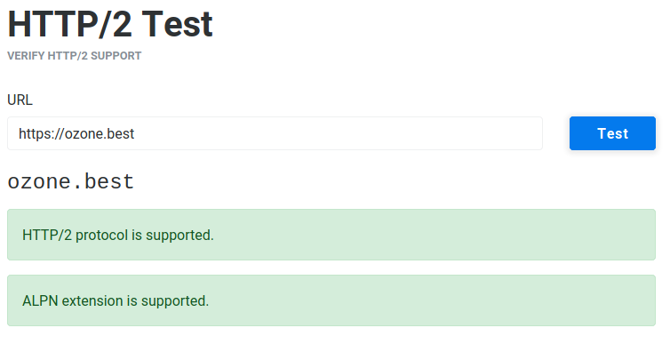
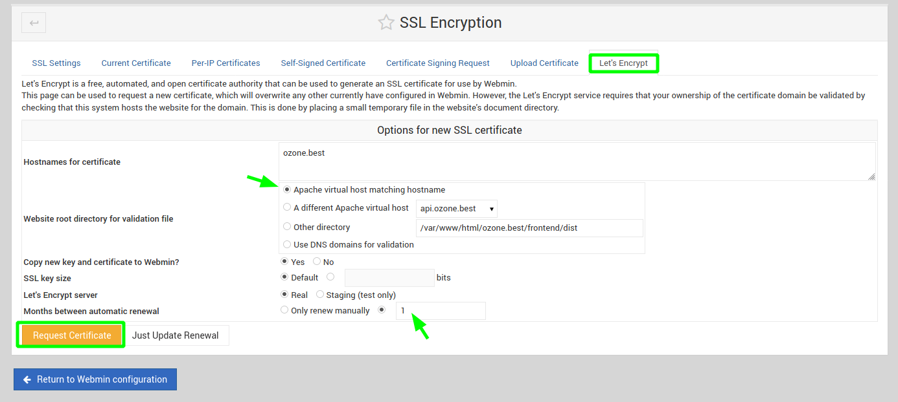
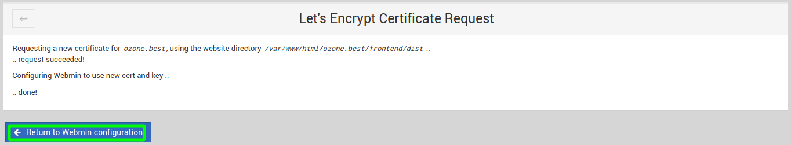

# **Installation de base du serveur :**

**Sur VPS OVH Modèle `VPS 2018 SSD 1` avec une Debian 10 fraichement installée !**

>**Voici les données `serveur/utilisateur` utilisées dans cette documentation :**
> - Nom de l'utilisateur Linux à créer : `dbl-lnx`
> - Adresse mail de l'admin du Serveur : `dbl-bzh@mailfence.com`
> - Nom de domaine du serveur VPS : `depan-heure.com` (peut être remplacé par l'adresse IP du serveur si aucun domaine associé)
> 
>_Un petit rechercher et remplacer dans tout le document pour adapter à votre cas !_

## **Mise en place de la sécurisation de la connexion SSH :**

[Lien vers documentation complète](https://www.ssh.com/ssh/copy-id#setting-up-public-key-authentication)

>**Première connexion en root pour créer une entrée dans le known_hosts de la machine cliente :**
>
>`ssh root@depan-heure.com` _(saisir le mot de passe root SSH qui vous a été communiqué par mail suite à l'installation du VPS)_

>**Pour des raisons de sécurité, commencer par changer le port par défaut d'utilisation de SSH :**
>
>`nano /etc/ssh/sshd_config`
>
>Décommenter et modifier la ligne :
> 
>`# Port 22`
>
>pour
> 
>`Port 22522` 
> 
> _(Vous pouvez utiliser un autre port de votre choix, attention cependant de ne pas en choisir un déjà utilisé)_
>
> _On sauvegarde avec CTRL+X puis O ou Y si en Anglais_
>
> Relancer encuite le service SSH en tapant `systemctl restart sshd`
>
> Se déconnecter en tapant `exit`
>
> Il faut maintenant supprimer l'entrée créée dans le fichier `~/.ssh/known_hosts` lors de votre première connexion en SSH et qui est devenue obsolète suite au changement du port SSH.
>
> Ce sera normalement la dernière ligne du fichier.
> 
> Elle contiendra le nom de domaine `depan-heure.com` ou l'adresse IP, si vous n'avez pas de domaine
> 
> Exemple : `depan-heure.com ecdsa-sha2-nistp256 AAAAE2VjZHNhLXNoYTItbm`...
>
> _On sauvegarde avec CTRL+X puis O ou Y si en Anglais_
>
> On se reconnecte en tapant `ssh root@depan-heure.com -p 22522` pour ajouter une nouvelle entrée au fichier `~/.ssh/known_hosts` (on précise cette fois le port à utiliser)
> 
> On se déconnecte en tapant `exit`

> **Ajout de la clef SSH cliente au serveur pour éviter de devoir rentrer le password à chaque connexion :**
>
>`ssh-copy-id -i ~/.ssh/id_rsa root@depan-heure.com -p 22522`

## **Création d'un nouvel utilisateur sudo :**

> **Création de l'utilisateur :**
>
>`adduser dbl-lnx`

> **Ajout de l'utilisateur au groupe sudo :**
>
>`usermod -aG sudo dbl-lnx`

> **Connexion immédiate sur ce nouvel utilisateur :**
>
>`su - dbl-lnx`

>Si vous le souhaitez vous pouvez également copier la clef SSH, depuis la ligne de commande de votre système, comme pour le compte root afin de ne plus devoir saisir le mot de passe à chaque connexion :
>
>`ssh-copy-id -i ~/.ssh/id_rsa -p 22522 dbl-lnx@depan-heure.com`

## **Création d'un espace de swap :**

> **Pour vérifier si il existe un espace de swap :**
>
>`sudo swapon --show`
>
> - Si un espace de SWAP existe çà doit retourner quelque chose comme ceci :
>
>`NAME      TYPE SIZE USED PRIO`
>
>`/swapfile file   2G   0B   -2`
>
> - Si aucun espace de SWAP n'existe çà ne retourne rien

> **Création d'une partition swap de 2G :**
>
>`sudo fallocate -l 2G /swapfile`
>
>`sudo chmod 600 /swapfile`
>
>`sudo mkswap /swapfile`
>
>`sudo swapon /swapfile`

## **Installation de GIT, création de la clef SSH et association avec GITHUB :**

> **Installation de GIT :**
>
>`sudo apt install git`

> **Création de la clef SSH et association avec GITHUB :**
>
> - https://fr.w3docs.com/snippets/git/comment-generer-une-cle-ssh-pour-git.html

## **On créé un alias de domaine pour notre API :**

> **Via l'interface de gestion du domaine :**
> 
> Pour `depan-heure.com` chez OVH l'url est :
> 
> https://www.ovh.com/manager/web/#/configuration/domain/depan-heure.com/zone
> 
> Ajouter une entrée de ce type en mode textuel : _(Remplacer `IP` par l'IPV4 de votre VPS)_
> 
>`api       IN A      IP`

## **Installation LAMP Stack (Linux/Apache/MySQL/PHP) :**

### **Ajout du repo Sury pour Debian 10 :**
 _Contient notamment les dernières versions de PHP et Extensions_
> **Ajout de GNUPG pour la gestion sécurisée des repositories additionnels :**
> 
> `sudo apt install gnupg`

> **Ajout du repo Sury aux sources logicielles :**
>
>`wget -q https://packages.sury.org/php/apt.gpg -O- | sudo apt-key add -`
>
>`sudo echo "deb https://packages.sury.org/php/ buster main" | sudo tee /etc/apt/sources.list.d/php.list`

### **Installation Apache Web Server :**
>[Lien vers la documentation complète](https://linuxize.com/post/how-to-install-apache-on-debian-10/)
>
>`sudo apt-get install apache2 apache2-doc`

#### **Création du dossier `/var/www/html/depan-heure.com`, qui contient notre site (Front & Back) :**

>`sudo mkdir /var/www/html/depan-heure.com`

#### **Modification des droits sur le dossier `/var/www/html/depan-heure.com`**
>`sudo chown -R $USER:www-data /var/www/html/depan-heure.com`
>
>`sudo chmod -R g+rw /var/www/html/depan-heure.com`
>
>_Ces commandes devront surement être réutilisées à chaque nouvelle mise en prod de votre site_

#### **Dossier de création des VirtualHosts pour chacun de nos nouveaux sites :**

> **Par defaut Apache pointe sur /var/www/html (pour des raisons de sécurité, le désactiver):**
>
>`sudo a2dissite 000-default.conf`
>
>_Les fichiers de conf des sites se trouvent dans  `/etc/apache2/sites-available/`_

> **On va maintenant créer un nouveau fichier pour `depan-heure.com` :**
>
>`sudo nano /etc/apache2/sites-available/depan-heure.com.conf`

> **Contenu du fichier pour Frontend React + Backend Api Symfo sur le même serveur :**
>
>```
># FRONTEND 
><VirtualHost *:80>
>ServerName depan-heure.com
>ServerAdmin dbl.bzh@mailfence.com
>DocumentRoot "/var/www/html/depan-heure.com/frontend/dist"
>Redirect permanent / https://depan-heure.com/
>
><Directory /var/www/html/depan-heure.com/frontend/dist>
>       Options +Indexes +Includes +FollowSymLinks +MultiViews
>       AllowOverride All
>               <IfModule mod_rewrite.c>
>                       RewriteEngine On
>                       # If an existing asset or directory is requested go to it as it is
>                       RewriteCond %{DOCUMENT_ROOT}%{REQUEST_URI} -f [OR]
>                       RewriteCond %{DOCUMENT_ROOT}%{REQUEST_URI} -d
>                       RewriteRule ^ - [L]
>                       # If the requested resource doesn't exist, use index.html
>                       RewriteRule ^ /index.html
>               </IfModule>
>       Require all granted
></Directory>
>
>ErrorLog ${APACHE_LOG_DIR}/error.log
>CustomLog ${APACHE_LOG_DIR}/access.log combined
>RewriteCond %{SERVER_NAME} =depan-heure.com
>RewriteRule ^ https://%{SERVER_NAME}%{REQUEST_URI} [END,NE,R=permanent]
></VirtualHost>
>
># BACKEND 
><VirtualHost *:80>
>ServerName api.depan-heure.com
>ServerAdmin dbl.bzh@mailfence.com
>DocumentRoot "/var/www/html/depan-heure.com/backend/public"
>Redirect permanent / https://api.depan-heure.com/
>DirectoryIndex /index.php
>
><IfModule mod_headers.c>
>        Header set Access-Control-Allow-Origin "*"
></IfModule>
>
><Directory /var/www/html/depan-heure.com/backend/public>
>       AllowOverride None
>       Require all granted
>       FallbackResource /index.php
></Directory>
>
>ErrorLog ${APACHE_LOG_DIR}/error.log
>CustomLog ${APACHE_LOG_DIR}/access.log combined
>RewriteEngine on
># Authorization  header
># Règles spécifiques pour le bon fonctionnement du JWT
>RewriteCond %{HTTP:Authorization} ^(.*)
>RewriteRule .* - [e=HTTP_AUTHORIZATION:%1]
>RewriteCond %{SERVER_NAME} =api.depan-heure.com
>RewriteRule ^ https://%{SERVER_NAME}%{REQUEST_URI} [END,NE,R=permanent]
></VirtualHost>
>```
>_On sauvegarde avec CTRL+X puis O ou Y si en Anglais_

> **On oublie pas d'activer notre nouveau site avec la commande :**
>
>`sudo a2ensite depan-heure.com.conf`

### **Installation des certificats HTTPS (SSL/TLS) avec certbot pour Apache :**
[Lien vers la documentation complète](https://linuxhint.com/setup_free_ssl_cert_apache_debian/)
> **On installe les paquets nécessaires :**
>
>`sudo apt install certbot python-certbot-apache ca-certificates apt-transport-https -y`
>
> **On créé les certificats :**
>
>`sudo certbot --apache`
>
> - Choisir les sites pour lesquels on veut obtenir un certificat (laisser vide si on veut sécuriser tous les sites)
> - Ensuite choisir le choix `2` de préférence pour donner l'ordre de forcer la redirection sur HTTPS
> - Une fois fait, normalement un message semblable devrait s'afficher si tout s'est bien passé :
>
>```
> - Congratulations! Your certificate and chain have been saved at:
>   /etc/letsencrypt/live/api.depan-heure.com/fullchain.pem
>   Your key file has been saved at:
>   /etc/letsencrypt/live/api.depan-heure.com/privkey.pem
>   Your cert will expire on 2020-04-24. To obtain a new or tweaked
>   version of this certificate in the future, simply run certbot again
>   with the "certonly" option. To non-interactively renew *all* of
>   your certificates, run "certbot renew"
> - Your account credentials have been saved in your Certbot
>   configuration directory at /etc/letsencrypt. You should make a
>   secure backup of this folder now. This configuration directory will
>   also contain certificates and private keys obtained by Certbot so
>   making regular backups of this folder is ideal.
>```

> **Pour renouveller tous les certificats :**
>
>`certbot renew`

> **Forcer la redirection sur HTTPS via VirtualHosts (Ajout de la ligne `Redirect permanent` dans `depan-heure.com.conf`):**
>
>```
># FRONTEND oZone
><VirtualHost *:80>
>ServerName depan-heure.com
>ServerAdmin dbl.bzh@mailfence.com
>DocumentRoot "/var/www/html/depan-heure.com/frontend/dist"
>Redirect permanent / https://depan-heure.com/
>
># BACKEND oZone
><VirtualHost *:80>
>ServerName api.depan-heure.com
>ServerAdmin dbl.bzh@mailfence.com
>DocumentRoot "/var/www/html/depan-heure.com/backend/public"
>Redirect permanent / https://api.depan-heure.com/
>```

> **Lors de la génération des certificats HTTPS (SSL/TLS), une réplique du fichier .conf est créée :**
>
>`sudo nano /etc/apache2/sites-available/depan-heure.com-le-ssl.conf`

> **Contenu du fichier pour Frontend React + Backend Api Symfo sur le même serveur :**
>
>```
><IfModule mod_ssl.c>
>Protocols h2 h2c http/1.1
># FRONTEND
><VirtualHost *:443>
>ServerName depan-heure.com
>ServerAdmin dbl.bzh@mailfence.com
>DocumentRoot "/var/www/html/depan-heure.com/frontend/dist"
>
><Directory /var/www/html/depan-heure.com/frontend/dist>
>       Options +Indexes +Includes +FollowSymLinks +MultiViews
>       AllowOverride All
>               <IfModule mod_rewrite.c>
>                       RewriteEngine On
>                       # If an existing asset or directory is requested go to it as it is
>                       RewriteCond %{DOCUMENT_ROOT}%{REQUEST_URI} -f [OR]
>                       RewriteCond %{DOCUMENT_ROOT}%{REQUEST_URI} -d
>                       RewriteRule ^ - [L]
>                       # If the requested resource doesn't exist, use index.html
>                       RewriteRule ^ /index.html
>               </IfModule>
>       Require all granted
></Directory>
>
>ErrorLog ${APACHE_LOG_DIR}/error.log
>CustomLog ${APACHE_LOG_DIR}/access.log combined
># Some rewrite rules in this file were disabled on your HTTPS site,
># because they have the potential to create redirection loops.
>
># RewriteCond %{SERVER_NAME} =depan-heure.com
># RewriteRule ^ https://%{SERVER_NAME}%{REQUEST_URI} [END,NE,R=permanent]
>
>
>SSLCertificateFile /etc/letsencrypt/live/depan-heure.com-0001/fullchain.pem
>SSLCertificateKeyFile /etc/letsencrypt/live/depan-heure.com-0001/privkey.pem
>Include /etc/letsencrypt/options-ssl-apache.conf
></VirtualHost>
></IfModule>
>
># BACKEND
><IfModule mod_ssl.c>
><VirtualHost *:443>
>ServerName api.depan-heure.com
>ServerAdmin dbl.bzh@mailfence.com
>DocumentRoot "/var/www/html/depan-heure.com/backend/public"
>DirectoryIndex /index.php
>
><IfModule mod_headers.c>
>#        Header set Access-Control-Allow-Origin "*"
></IfModule>
>
><Directory /var/www/html/depan-heure.com/backend/public>
>       AllowOverride None
>       Require all granted
>       FallbackResource /index.php
></Directory>
>
>ErrorLog ${APACHE_LOG_DIR}/error.log
>CustomLog ${APACHE_LOG_DIR}/access.log combined
>RewriteEngine on
># Authorization  header
># Règles spécifiques pour le bon fonctionnement du JWT
>RewriteCond %{HTTP:Authorization} ^(.*)
>RewriteRule .* - [e=HTTP_AUTHORIZATION:%1]
># Some rewrite rules in this file were disabled on your HTTPS site,
># because they have the potential to create redirection loops.
>
># RewriteCond %{SERVER_NAME} =api.depan-heure.com
># RewriteRule ^ https://%{SERVER_NAME}%{REQUEST_URI} [END,NE,R=permanent]
>
>SSLCertificateFile /etc/letsencrypt/live/depan-heure.com-0001/fullchain.pem
>SSLCertificateKeyFile /etc/letsencrypt/live/depan-heure.com-0001/privkey.pem
>Include /etc/letsencrypt/options-ssl-apache.conf
></VirtualHost>
>```
>_On sauvegarde avec CTRL+X puis O ou Y si en Anglais_

### **Installation PHP avec Apache (+ quelques extensions indispensables) :**
[Lien vers la documentation complète](https://linuxize.com/post/how-to-install-php-on-debian-10/)

`sudo apt install php libapache2-mod-php php-json php-mbstring php-zip php-gd php-xml php-curl php-mysql`

>**Installation de toutes les extensions Symfony pour PHP (optionel) :**
>
>`sudo apt install php-symfony*`

### **Mise en place du support HTTP2 pour Apache :**
[Lien vers la documentation complète](https://www.howtoforge.com/how-to-enable-http-2-in-apache/)
>
_**Attention : HTTP2, ne peut fonctionner que avec du HTTPS !**_

> **On vérifie la version de PHP installée :**
>
>`php -v`
>
> Devrait normalement afficher quelque chose comme ceci :
>```
>PHP 7.4.4 (cli) (built: Mar 20 2020 14:30:40) ( NTS )
>Copyright (c) The PHP Group
>Zend Engine v3.4.0, Copyright (c) Zend Technologies
>with Zend OPcache v7.4.4, Copyright (c), by Zend Technologies
>```

> **On installe la version de `php-fpm` correspondante :**
>
> `sudo apt install php7.4-fpm`
 
> **On désactive le module `php7.4` actuellement en service :**
>
> `sudo a2dismod php7.4`

> **On charge la config de `php7.4-fpm` :**
>
> `sudo a2enconf php7.4-fpm`

> **On active le module `proxy_fcgi` & `setenvif` :**
>
> `sudo a2enmod proxy_fcgi && sudo a2enmod setenvif`

> **On désactive le module `mpm_prefork` qui ne gère pas le HTTP2 :**
>
> `sudo a2dismod mpm_prefork`

> **On active le module `mpm_event` qui gère le HTTP2 :**
>
> `sudo a2enmod mpm_event`

> **On active les modules `ssl` & `http2` :**
>
> `sudo a2enmod ssl && sudo a2enmod http2`

> **Maintenant il faut dire à Apache que l'on veut du `http2` :**
>
> - Soit dans la config d'Apache générale (pour que la directive s'applique à tous les sites) :
>
> `sudo nano /etc/apache2/apache2.conf`
> 
> Tout en bas du fichier, on ajoute ces deux lignes :
>```
># HTTP2 Support
>Protocols h2 h2c http/1.1
>```
>
> - Soit dans la config d'Apache d'un site en particulier (ici `depan-heure.com`) :
>
> `sudo nano /etc/apache2/sites-available/depan-heure.com-le-ssl.conf`
> 
> On ajoute cette ligne `Protocols h2 h2c http/1.1` :
> 
> 1) Pour le Frontend :
>```
><IfModule mod_ssl.c>
>Protocols h2 h2c http/1.1
># FRONTEND
><VirtualHost *:443>
>```
> 
> 2) Pour le Backend :
>```
><IfModule mod_ssl.c>
>Protocols h2 h2c http/1.1
># BACKEND
><VirtualHost *:443>
>```

> **On redémarre Apache pour la prise en compte de tous ces changements :**
>
> `sudo systemctl restart apache2`

> **On vérifie que le serveur Web tourne bien en HTTP2 à présent :**
> 
> https://tools.keycdn.com/http2-test
>
> _Normalement çà devrait donner quelque chose comme çà :_
> 
> 

### **Installation de MariaDB Server :**
[Lien vers la documentation complète](https://linuxize.com/post/how-to-install-mariadb-on-debian-10/)

`sudo apt install mariadb-server`

> **Sécuriser l'installation de MariaDB server**
>
>`sudo mysql_secure_installation`
>
>```
>Enter current password for root (enter for none):
>...
>Set root password? [Y/n] Y
>New password: 
>Re-enter new password: 
>...
>Remove anonymous users? [Y/n] Y
>...
>Disallow root login remotely? [Y/n] Y
>...
>Remove test database and access to it? [Y/n] Y
>...
>Reload privilege tables now? [Y/n] Y
>...
>Thanks for using MariaDB!
>```

> **Modifier la méthode d'authentification root par defaut :**
>
>`sudo mysql`
>
>```sql
>ALTER USER 'root'@'localhost' IDENTIFIED VIA mysql_native_password;
>ALTER USER 'root'@'localhost' IDENTIFIED BY 'new_root_password';
>```
>_Pour vérifier que çà fonctionne on tente de se reconnecter sans le sudo avec le mdp défini `new_root_password`_
>
>`mysql -u root -p`

> **Créer un nouvelle utilisateur de la base de données avec les pleins pouvoirs :**
> 
>_Remplacer `user` et `password` par les les identifiants souhaités_
>```sql
>GRANT ALL ON *.* TO 'user'@'localhost' IDENTIFIED BY 'password';
>FLUSH PRIVILEGES;
>```

### **Installation de PHPMyAdmin (avec support HTTPS):**
[Lien vers la documentation complète](https://linuxhint.com/install_phpmyadmin_debian_10/)

> **On créé un alias de domaine sur l'interface de gestion du domaine :**
> 
> Pour `depan-heure.com` chez OVH l'url est :
> 
> https://www.ovh.com/manager/web/#/configuration/domain/depan-heure.com/zone
> 
> Ajouter une entrée de ce type en mode textuel : _(Remplacer `IP` par l'IPV4 de votre VPS)_
> 
>`pma       IN A      IP`

> **[Télécharger la dernière version de phpMyAdmin](https://www.phpmyadmin.net/downloads/) :**
>
>_Penser à adapter les commandes ci-dessus avec les bons numéros de version ici : `5.0.2`)_
>
>`wget https://files.phpmyadmin.net/phpMyAdmin/5.0.2/phpMyAdmin-5.0.2-all-languages.zip`

> **Installation du paquet unzip permettant de décompresser le package :**
>
>`sudo apt install unzip`

> **Décompression du package dans le dossier `/opt` :**
>
>`sudo unzip phpMyAdmin-5.0.2-all-languages.zip -d /opt`

> **Renommer le dossier généré en quelque chose de plus simple :**
>
>`sudo mv /opt/phpMyAdmin-5.0.2-all-languages /opt/phpMyAdmin`

> **On modifie les droits sur le dossier phpMyAdmin pour Apache :**
>
>`sudo chown -Rfv www-data:www-data /opt/phpMyAdmin`

> **On créé une copie du fichier de conf phpMyAdmin d'exemple par défaut :**
>
>`sudo cp /opt/phpMyAdmin/config.sample.inc.php /opt/phpMyAdmin/config.inc.php`

> **On génère un `blowfish_secret` plus fort :**
> 
> [Strong Password Generator](https://passwordsgenerator.net/)
> 
> Password Length : `64`
>  
> Exclude Ambiguous Characters : `On coche`
> 
> Puis on clique sur `Generate`
> 
> exemple de password généré : `XaHLA&rQh+5xXmc3Q#&4D#T!#=eX*y#sRx6F_fxXnuZYugBvFa+3xj9^es=Esj#W`


> **On modifie donc le blowfish_secret (en le remplaçant par celui généré ci-dessus):**
>
>`sudo nano /opt/phpMyAdmin/config.inc.php`
>
>```
>$cfg['blowfish_secret'] = 'XaHLA&rQh+5xXmc3Q#&4D#T!#=eX*y#sRx6F_fxXnuZYugBvFa+3xj9^es=Esj#W';
>```
>_On sauvegarde avec CTRL+X puis O ou Y si en Anglais_

> **On edite un fichier de conf Apache pour phpMyAdmin :**
>
>`sudo nano /etc/apache2/sites-available/phpmyadmin.conf`

> **Contenu du fichier :** 
> 
> _Modifier le port `*:9000` par autre chose si nécessaire ainsi que l'adresse mail `ServerAdmin`_
>
>```
><VirtualHost *:9000>
>ServerAdmin dbl.bzh@mailfence.com
>ServerName pma.depan-heure.com
>DocumentRoot /opt/phpMyAdmin
> 
><Directory /opt/phpMyAdmin>
>       Options Indexes FollowSymLinks
>       AllowOverride none
>       Require all granted
></Directory>
>       ErrorLog ${APACHE_LOG_DIR}/error_phpmyadmin.log
>       CustomLog ${APACHE_LOG_DIR}/access_phpmyadmin.log combined
></VirtualHost>
>```
>_On sauvegarde avec CTRL+X puis O ou Y si en Anglais_

> **On modifie les ports écoutés par Apache :** _(On ajoute la ligne `Listen 9000` ou autre si port changé à l'étape d'avant)_
>
>`sudo nano /etc/apache2/ports.conf`
>
>```
># If you just change the port or add more ports here, you will likely also
># have to change the VirtualHost statement in
># /etc/apache2/sites-enabled/000-default.conf
>
>Listen 80
>Listen 9000
>
><IfModule ssl_module>
>        Listen 443
></IfModule>
>
><IfModule mod_gnutls.c>
>        Listen 443
></IfModule>
>
># vim: syntax=apache ts=4 sw=4 sts=4 sr noet
>```
>_On sauvegarde avec CTRL+X puis O ou Y si en Anglais_

> **On charge la conf créée pour phpMyAdmin dans Apache :**
>
>`sudo a2ensite phpmyadmin.conf`

> **On redémarre le service Apache :**
>
>`sudo systemctl restart apache2`

> **Vous devriez normalement pouvoir accéder à PMA via l'adresse de cette forme :**
>
> https://depan-heure.com:9000 _(remplacer par votre domaine à vous si ce n'est pas déjà fait)_
> 
>_Il vous dit sûrement que le certificat HTTPS n'est pas bon (un point d'exclamation sur le petit cadenas !)_

> **Il suffit maintenant d'utiliser `certbot` pour générer un certificat pour pma :**
>
>`sudo certbot --apache`
>
> - On séléctionne le choix correspondant à `pma` dans les choix proposés
> - On séléctionne ensuite l'option `2` pour forcer la redirection sur HTTPS

> **On va ensuite vérifier notre fichier de conf Apache généré `phpmyadmin-le-ssl.conf` :**
> 
> `sudo nano /etc/apache2/sites-available/phpmyadmin-le-ssl.Conf`
>
> _**Dans ce fichier on devrait normalement avoir quelque chose comme ceci :**_
> 
> _Qui dit qu'on charge le certificat ssl généré à l'étape précédente seulement si le module Apache SSL est activé !_
> 
> _Personnellement j'en ai profité pour réindenter tout çà afin de le rendre plus clair à lire..._
> 
>```
> <IfModule mod_ssl.c>
>        <VirtualHost *:443>
>        ServerAdmin dbl.bzh@mailfence.com
>        ServerName pma.depan-heure.com
>        DocumentRoot /opt/phpMyAdmin
>
>        <Directory /opt/phpMyAdmin>
>                Options Indexes FollowSymLinks
>                AllowOverride none
>                Require all granted
>        </Directory>
>                ErrorLog ${APACHE_LOG_DIR}/error_phpmyadmin.log
>                CustomLog ${APACHE_LOG_DIR}/access_phpmyadmin.log combined
>                Include /etc/letsencrypt/options-ssl-apache.conf
>                SSLCertificateFile /etc/letsencrypt/live/pma.depan-heure.com/fullchain.pem
>                SSLCertificateKeyFile /etc/letsencrypt/live/pma.depan-heure.com/privkey.pem
>        </VirtualHost>
></IfModule>
>
><VirtualHost *:9000>
>ServerAdmin dbl.bzh@mailfence.com
>ServerName pma.depan-heure.com
>DocumentRoot /opt/phpMyAdmin
>
><Directory /opt/phpMyAdmin>
>        Options Indexes FollowSymLinks
>        AllowOverride none
>        Require all granted
></Directory>
>        ErrorLog ${APACHE_LOG_DIR}/error_phpmyadmin.log
>        CustomLog ${APACHE_LOG_DIR}/access_phpmyadmin.log combined
></VirtualHost>
>```
>_On sauvegarde avec CTRL+X puis O ou Y si en Anglais_

> **On redémarre le service Apache :**
>
>`sudo systemctl restart apache2`

> **Voilà si votre pma est sécurisé par certificat SSL, le cadenas est débarrassé de ce facheux point d'exclamation !**
> 
> _Voici ce que çà donne sous Firefox :_
> 
> 
> 
> _Voici ce que çà donne sous Chrome :_
> 
> 

## **Installation de Webmin (interface Web pour la gestion du Serveur) :**
> **Téléchargement de la clef de vérification (sécurité) :**
> 
> `wget http://www.webmin.com/jcameron-key.asc`

> **Ajout de la clef de vérification (sécurité) au système :**
> 
> `sudo apt-key add jcameron-key.asc`

> **Mise à jour des paquets disponibles & Installation de Webmin :**
> 
> `sudo apt update && sudo apt install webmin`

> **Sécuriser l'accès à Webmin en intégrant le certificat SSL précédemment généré :**
> 
> - Rendez-vous à l'adresse suivante :
> _(Adaptez l'url pour votre domaine si ce n'est pas déjà fait !)_
> 
> https://depan-heure.com:10000/webmin/edit_ssl.cgi?xnavigation=1
> 
> _Les identifiants de connexion à Webmin sont vos identifiants Linux, ceux générés lors de le création de l'utilisateur en ligne de commande SSH au tout début de cette documentation._
> 
> - On se rend sur l'onglet `Let's Encrypt` :
> 
> 
> - Vous pouvez utiliser le `automatic renewal`, personnellement j'ai choisi de renouveler tous les mois !
> 
> - Puis cliquer sur `Request Certificate`
> 
>  - Si tout se passe bien vous obtiendrez (votre certificat sera déclaré pour webmin également) :
> 
> 

## **Installation de Node.js :**

https://github.com/nodesource/distributions

```bash
cd ~
curl -sL https://deb.nodesource.com/setup_14.x -o nodesource_setup.sh
sudo bash nodesource_setup.sh
```

## **Installation de LexikJWTBundle :**

https://github.com/lexik/LexikJWTAuthenticationBundle

> **Génération des clefs `private` et `public` sur le serveur** :
> 1) Création du dossier qui va contenir les clefs
> 
>`mkdir -p config/jwt`
>
> 2) Génération de la clef `private.pem`
>
>`openssl genpkey -out config/jwt/private.pem -aes256 -algorithm rsa -pkeyopt rsa_keygen_bits:4096`
>
>
>_Saisir la `JWT passphrase` renseignée dans le fichier `.env` lorsqu'il la demande_
>
> 3) Génération de la clef `public.pem`
>
>`openssl pkey -in config/jwt/private.pem -out config/jwt/public.pem -pubout`
>
>_Saisir la `JWT passphrase` renseignée dans le fichier `.env` lorsqu'il la demande_
>

> **Règles à ajouter dans la config d'Apache (VirtualHost ou .htaccess)** :
>```
># Règles spécifiques pour le bon fonctionnement du JWT
># Authorization  header
>RewriteEngine on
>RewriteCond %{HTTP:Authorization} ^(.*)
>RewriteRule .* - [e=HTTP_AUTHORIZATION:%1]
>```
